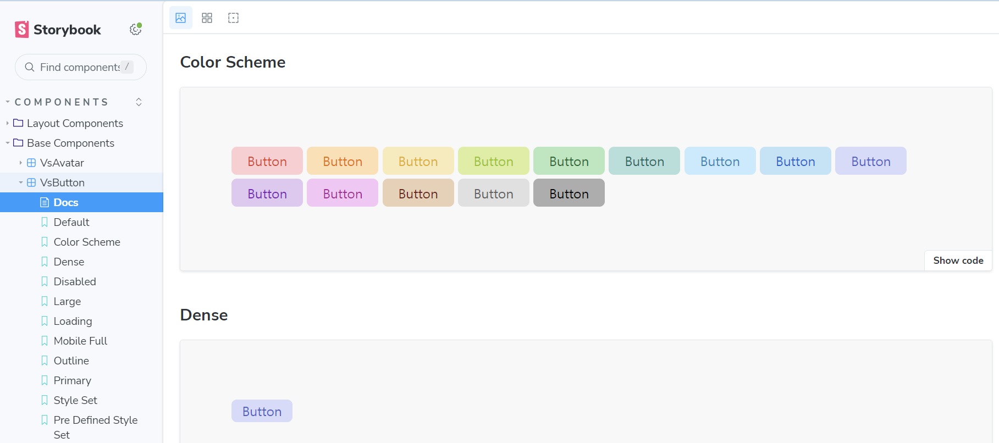

# Vlossom 🌸

<p align="center">
	
</p>

<p align="center">
  <a href="https://vuejs.org/">
    
  </a>
  <br/>
  <a href="https://www.npmjs.com/package/vlossom">
    
  </a>
   <a href="https://github.com/pubg/vlossom/blob/main/CONTRIBUTING.md#license">
    
  </a>
</p>

Vlossom is a vibrant and versatile Vue UI library designed to blossom your web applications with elegance and ease.

## 🌟 Special Sponsors

<div style="display:flex; align-items:center;">
	<a href="https://www.krafton.com/" target="_blank">
		 
	</a>
	&nbsp;&nbsp;&nbsp;&nbsp
	<a href="https://github.com/pubg" target="_blank">
		
	</a>
</div>

<br/>

## ⚡ Quick Start

### 1. Terminal

Vlossom can be downloaded via npm

```sh
npm i vlossom
```

### 2. CDN

You can also download Vlossom via CDN

#### unpkg

https://unpkg.com/browse/vlossom@0.0.1/

#### jsdelivr

https://www.jsdelivr.com/package/npm/vlossom

## 🎮 Playground

Experiment with your code by utilizing components in the Playground.

```sh
cd packages/vlossom
npm run dev
```

## 📖 Storybook

Explore the usage of components within the Storybook.



```sh
cd packages/vlossom
npm run storybook
```

## 🙌 Contributing

If you're interested in contributing, we highly recommend reading the [Contributing.md](https://github.com/pubg/vlossom/blob/main/CONTRIBUTING.md) and following the guidelines provided.

## 📑 License

By contributing your code to the [vlossom](https://github.com/pubg/vlossom) GitHub repository,
you agree to license your contribution under the [MIT license](/LICENSE).
